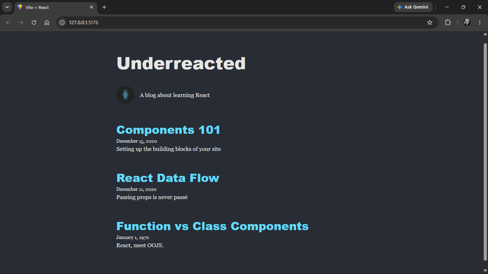

# Blog Site React Lab

## Project Description

This project is a simple blog website built with React. It demonstrates how to create reusable components, pass data using props, and render multiple blog posts using React components.

## Features

- Header component displaying the blog title
- About component displaying the blog logo and description
- Article List component that renders all blog posts
- Article component displaying the title, date and preview of each post
- Props used to pass data between components
- Default values for missing props
- Rendered lists using the .map() method

## Project Structure

src
assets
components
App.jsx
Header.jsx
About.jsx
ArticleList.jsx
Article.jsx
data
blog.js
main.jsx

## Installation

Clone the repository:
Navigate into the project folder:
Install the project dependencies:

## Running the Project

Start the development server
Open the local URL displayed in the terminal

## Running the Tests

Run the test suite with: npm test

## Screenshot

A screenshot of the completed site

## Technologies Used

- React
- JSX
- JavaScript
- Vite
- CSS

## Author

Created as part of the React Components and Props Lab By Michael Mwangi
